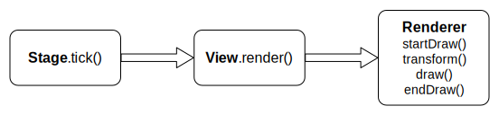

# 可视对象
---

简单来说，所有可见的东西都是可视对象，它可以是图片、精灵、文字、图形，甚至DOM元素等等。一个游戏应用就是由各种各样的可视对象构成的。

## 继承结构

Hilo采用面向对象的方式构建整个可视对象结构。下面是Hilo中可视对象的**继承结构图**：

从此图可以看到，View是可视对象基类，所有可视对象类都要继承此类。Container是容器类，可包含各种子对象，这两个类是最基本的类，其他的类都可由他们派生出来。

当前，Hilo中提供的可视对象类有：

* `View` - 可视对象基类。包含可视对象的基本属性和和方法。
* `Container` - 容器类。可包含子对象，实现容器或组的功能。
* `Stage` - 舞台类。它是一个特殊的容器，所有可视对象都必须添加到舞台才会显示出来。
* `Bitmap` - 位图类。最简单的可视对象，只显示一个图片。
* `Sprite` - 精灵类。多帧图片组成的动画序列。
* `Graphics` - 绘图类。使用canvas绘图API绘制各种形状的类。
* `DOMElement` - DOM元素类。可以像其他可视对象一样来控制和管理DOM元素。
* `Text` - 简单文本类。简单的canvas文本显示类。
* `Button` - 简单按钮类。实现简单图片按钮功能的类。

## 显示结构

Hilo里的可视对象显示结构是一种典型的树形结构。下面是可视对象的**显示结构图**：

从此图可以看到，Hilo里的显示结构与HTML DOM树的结构非常类似。其中，`View`相当于各种各样的`HTMLElement`；`Stage`相当于`body(HTMLBodyElement)`，是根节点和顶层容器；`Container`则相当于`div(HTMLDivElement)`，他可以包含作为叶子节点的`View`，也可以包含作为子容器的`Container`，而子容器`Container`又可以包含下一层的`View`和`Container`。这种灵活的显示结构可以形成非常复杂的显示结构，也方便对象管理。

## 渲染过程

整个渲染过程开始于舞台，当调用舞台Stage的`tick`方法后，会遍历整个显示结构树，逐个调用可视对象的`render`方法，而具体的渲染实现则由相应的渲染器`Renderer`完成。计时器`Ticker`会按照设定的`fps`频率不断的重复调用此渲染过程。

由于渲染器`Renderer`只会注入到舞台`Stage`，可视对象只需调用`Renderer`的统一接口，由此，可视对象就与渲染实现了基本的解耦，通过派生不同的`Renderer`可以轻松实现不同的渲染模式。